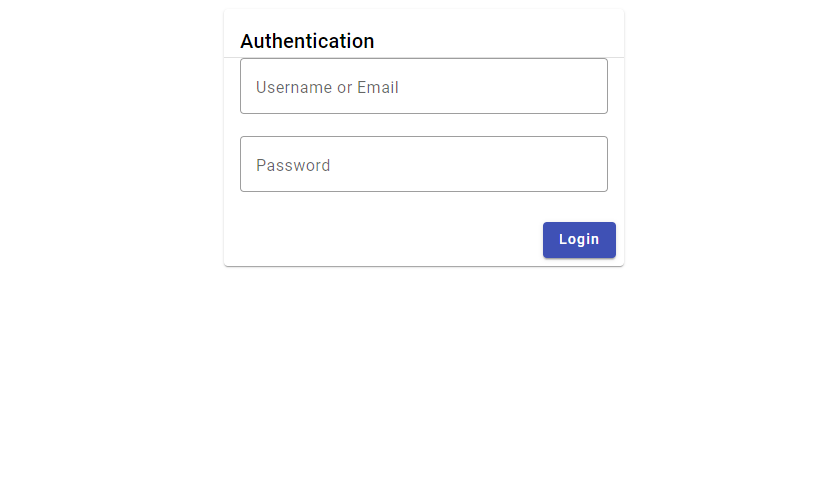
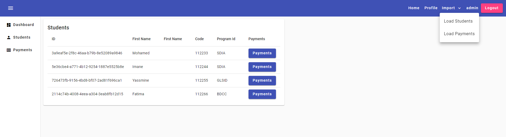
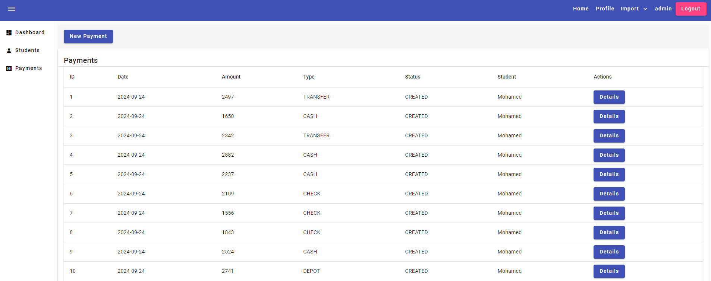

 <p1>This application, developed with Spring Boot for the backend and Angular Material for the frontend, is a simple authentication system. It enables the management of student payments, viewing the student list, adding new students, viewing payment records, adding payments, and uploading PDF payment justifications</p1>
 <h3>Authentication Page</h3>

 <h3>List of Students</h3>

 <h3>List of Payments</h3>

 <h3>Add a New Payment</h3>

 <h3>Payment Details Page for Each Student</h3>

